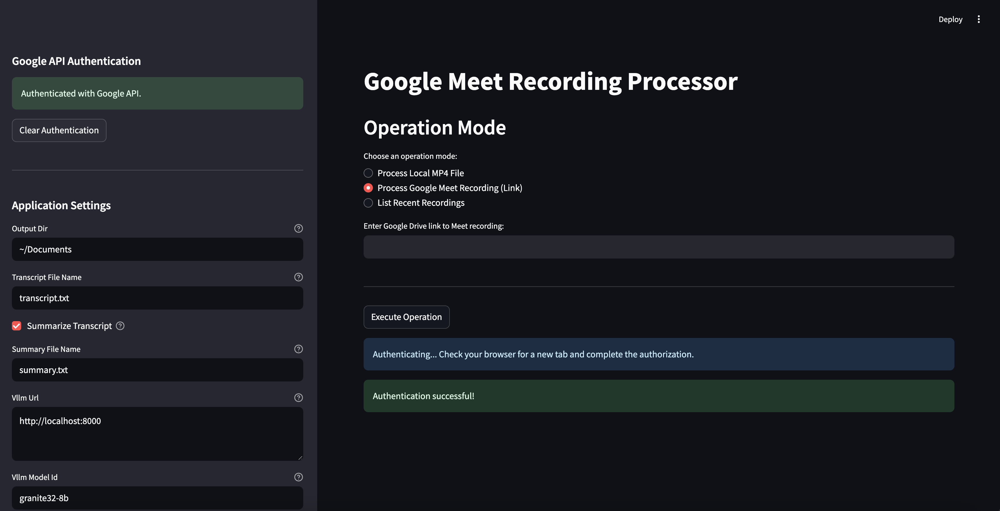
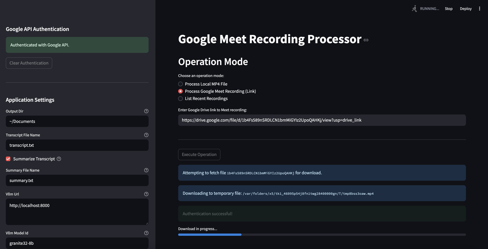
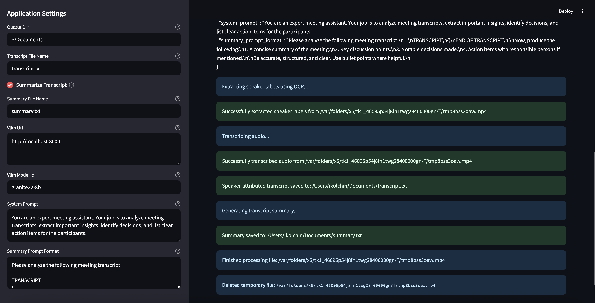

# Google Meet Recording Summarizer

This repository contains a Python application for transcribing, summarizing and analyzing Google Meet video recordings from Google Drive links and local files.









---

## Table of Contents

1.  [What Does This Application Do?](#1-what-does-this-application-do)

2.  [Prerequisites](#2-prerequisites)

    * [General Prerequisites](#general-prerequisites)

    * [For "Processing Local MP4 Files" Mode](#for-processing-local-mp4-files-mode)

    * [For "Streaming from Google Meet" Mode](#for-streaming-from-google-meet-mode)

        * [Google Workspace Account](#google-workspace-account)

        * [Google Cloud Project Setup](#google-cloud-project-setup)

3.  [Installation](#3-installation)

4.  [How to Run the Application (User Manual)](#4-how-to-run-the-application-user-manual)

    * [Graphical User Interface (GUI) Mode](#graphical-user-interface-gui-mode)

    * [Command-Line Interface (CLI) Mode](#command-line-interface-cli-mode)

5.  [Application Settings](#5-application-settings)

---

## 1. What Does This Application Do?

This application provides a fully open-source alternative to Google's built-in transcription feature for Google Meet. It enables users to extract high-quality, speaker-attributed transcripts and generate detailed meeting summaries entirely under their control. 

This solution is built entirely using open-source libraries, namely OpenAI Whisper for transcription, EasyOCR for detecting speaker names from video frames, and vLLM for running large language models locally. It allows for full control and precise customization at every stage—from how and where speaker names are detected, to the exact formulation of the system and user prompts used during the summarization process.

The application offers both a **Command-Line Interface (CLI)** for scripting and automation, and a **Graphical User Interface (GUI)** built with Streamlit for an interactive user experience.

The input for the application can either be fetched directly from a Google Drive link or provided as a local `.mp4` file (see user manual below).

---

## 2. Prerequisites

The requirements for running this application vary based on the mode of operation you choose.

### General Prerequisites

* **Python 3.8+:** The script is written in Python 3. Make sure you have a compatible version installed.

* A stable internet connection (especially for Google Meet streaming mode).

### For "Processing Local MP4 Files" Mode

This mode is designed to be very straightforward. It requires:

* An `.mp4` video file located on your local machine.

No Google Cloud Project setup, API enablement, or `credentials.json` file is required for this mode.

### For "Streaming from Google Meet" Mode

This mode requires interaction with Google's APIs to access your Meet recordings from Google Drive. This involves a one-time setup of a Google Cloud Project.

#### Google Workspace Account

* **Requirement:** You need a **Google Workspace edition that supports Google Meet recording**. This typically includes Business Standard, Business Plus, Enterprise, Teaching and Learning Upgrade, and Education Plus. Free personal Gmail accounts **do not** have the functionality to record Google Meet sessions, and therefore cannot be used with this script to access recordings.

* **Recording Rights:** You must be the meeting organizer or a co-host with explicit recording privileges for the Meet sessions you intend to access.

#### Google Cloud Project Setup

All interactions with Google APIs require a Google Cloud Project. This project acts as a central management point for billing, API access, and authentication.

#### Creating a Project

1.  Go to the [Google Cloud Console](https://console.cloud.google.com/).

2.  Sign in with your Google Account if prompted.

3.  In the top-left corner, click on the **project selector dropdown**.

4.  In the dialog, click **"NEW PROJECT"** at the top right.

5.  **Project Name:** Enter a descriptive name.

6.  **Organization:** **Crucially, ensure the "Organization" field correctly shows your Google Workspace organization.** This defines your app as "Internal."

7.  Click **"CREATE"**. Wait for the project to be created.

#### Enabling Google APIs

Your project needs explicit permission to use the Google Meet and Google Drive APIs.

1.  In the Google Cloud Console, ensure your newly created project is selected.

2.  Navigate to **"APIs & Services" > "Library"** from the left-hand navigation menu.

3.  **Enable Google Meet API:**

    * Search for `Google Meet API`.

    * Click on the result, then click the large **"ENABLE"** button.

4.  **Enable Google Drive API:**

    * Go back to the API Library.

    * Search for `Google Drive API`.

    * Click on the result, then click the large **"ENABLE"** button.

#### Configuring OAuth Consent Screen (for Internal Application)

This step allows users within your organization to grant your application permission to access their Google data.

1.  From the left-hand navigation menu, go to **"APIs & Services" > "OAuth consent screen"**.

2.  **User Type:** Select **"Internal"**. This option is only available for Google Workspace organizations and prevents the need for Google's app verification. Click **"CREATE"**.

3.  **App Registration:**

    * **App Name:** Enter a user-friendly name (e.g., "Internal Meet Recording Processor").

    * **User support email:** Choose your email.

    * **Developer contact information:** Enter your email.

    * Click **"SAVE AND CONTINUE"**.

4.  **Scopes:** This defines what data your application can access.

    * On the "Scopes" page, click **"ADD OR REMOVE SCOPES"**.

    * In the right-hand panel, search for and select:

        * `https://www.googleapis.com/auth/meetings.space.readonly` (for listing Meet records)

        * `https://www.googleapis.com/auth/drive.readonly` (for downloading Meet recording files from Drive)

    * Click **"UPDATE"** at the bottom of the panel.

    * Click **"SAVE AND CONTINUE"**.

5.  **Test Users:** For "Internal" apps, you **do not need to manually add test users** here. All users within your organization are authorized by default. Click **"SAVE AND CONTINUE"**.

6.  **Summary:** Review your settings and click **"BACK TO DASHBOARD"**.

#### Creating OAuth Client ID and `credentials.json`

This file uniquely identifies your application to Google for authentication.

1.  From the left-hand navigation menu, go to **"APIs & Services" > "Credentials"**.

2.  Click **"+ CREATE CREDENTIALS" > "OAuth client ID"**.

3.  **Application type:** Select **"Desktop app"**.

4.  **Name:** Give it a name (e.g., "Internal Meet Processor Desktop Client").

5.  Click **"CREATE"**.

6.  A dialog will show your Client ID and Client Secret. Click **"DOWNLOAD JSON"**.

7.  **Rename this file to `credentials.json`** and place it in the **root directory of this repository**.

### Requirements for Transcript Summarization

To use the summary generation feature, a running vLLM server is required. This server provides access to a local large language model (such as LLaMA or Granite) via an OpenAI-compatible API endpoint. The tool connects to this server to generate structured meeting summaries and action items based on your custom prompts. If no vLLM server is available, the summarization step can simply be skipped by setting the `summarize_transcript` setting to False (see instructions on configuring the runtime settings below). Transcription and speaker attribution will still work independently without issue.

---

## 3. Installation

Follow these steps to set up the application on your system:

1.  **Clone the Repository:**

    ```bash
    git clone https://github.com/ilya-kolchinsky/GMeetSummarizer.git
    cd GMeetSummarizer
    ```

2.  **Run the Setup Script:**
    This script automates Python environment setup and dependency installation.

    ```bash
    chmod +x setup.sh  # Make the script executable (Linux/macOS only)
    ./setup.sh
    ```

    *The `setup.sh` script will check for Python 3, create and activate a virtual environment (`venv`), and install all necessary Python packages from `requirements.txt`.*


3.  **Manual Placement of `credentials.json` (if using "Streaming from Google Meet" mode):**
    Ensure the `credentials.json` file you downloaded from Google Cloud Console is placed in the **root directory of this repository** (the same folder as `main.py`). This file is **not required** if you only plan to use the "Processing Local MP4 Files" mode.

---

## 4. How to Run the Application (User Manual)

The application supports two modes of operation: a graphical user interface (GUI) or a command-line interface (CLI).

**Before running, ensure your Python virtual environment is activated:**
If you ran `setup.sh`, your virtual environment (`venv`) should be created. To activate it in a new terminal session:

* **On macOS/Linux:** `source venv/bin/activate`

* **On Windows (Command Prompt):** `venv\Scripts\activate`

* **On Windows (PowerShell):** `venv\Scripts\Activate.ps1`


### Graphical User Interface (GUI) Mode

This mode is recommended for interactive use and provides a user-friendly Streamlit interface.

To launch the GUI, run the script via Streamlit with the `--ui` argument:

```bash
python -m streamlit run main.py -- --ui
```

*This will open a new tab in your web browser with the Streamlit application.*

* **Initial Google Authentication:** The first time you attempt a Google Meet-related operation (e.g., "Authenticate with Google" button click) in the UI, a new browser tab will open for Google's OAuth consent flow. Complete the authorization there, then return to the Streamlit app. A `token.json` file will be saved locally for future use.

* **UI Navigation:**

    * **Operation Mode:** Use the radio buttons to select between "Process Local MP4 File", "Process Google Meet Recording (Link)", or "List Recent Recordings".

    * **Input:** Enter the relevant path or link in the text box below the mode selection.

    * **Settings:** Adjust various application parameters in the sidebar on the left.

    * **Execute:** Click the "Execute Operation" button to start. This button will disable itself during processing to prevent spamming.

    * **Output Log:** All messages and progress bars will be displayed in the main area below the "Execute Operation" button.

### Command-Line Interface (CLI) Mode

This mode is suitable for scripting, automation, or when you prefer a terminal-based interaction.

You must specify **exactly one** of the following arguments to indicate the input source:

* `--local-file <path>`: To process a local MP4 file.

* `--google-drive-link <URL>`: To download and process a Google Meet recording from a direct Google Drive link.

* `--list-recordings`: To list recent Google Meet recordings only (does not process them automatically).

You can also override default application settings using additional command-line arguments.


##### Usage Examples:

* **Process a local MP4 file:**
```
python main.py --local-file /path/to/your/video.mp4
```
*(On Windows, use backslashes `\` or raw strings `r"C:\path\to\video.mp4"` for paths.)*

* **Download and process a Google Meet recording from a link:**
```
python main.py --google-drive-link "[https://drive.google.com/file/d/SOME_FILE_ID/view](https://drive.google.com/file/d/SOME_FILE_ID/view)"
```
*(Remember to enclose the URL in double quotes.)*

* **List recent Google Meet recordings:**
```
python main.py --list-recordings
```

* **Override a setting in CLI mode (e.g., output directory):**
```
python main.py --local-file /path/to/video.mp4 --output-dir /tmp/my_pr
```

---

## 5. Application Settings

The application uses a `settings.py` file to define default parameters. These defaults can be overridden by environment variables or command-line arguments (CLI mode) or via sidebar widgets (GUI mode). Command-line arguments have the highest precedence, followed by environment variables, then the `settings.py` defaults.

* **Overriding via Environment Variables (CLI Mode):**
For a setting named `my_setting`, set an environment variable `MY_SETTING` (uppercase, underscores instead of hyphens):

    * **Linux/macOS:** `export MY_CUSTOM_PARAM="new_value"`

    * **Windows (CMD):** `set MY_CUSTOM_PARAM="new_value"`

  * **Windows (PowerShell)**: `$env:MY_CUSTOM_PARAM="new_value"`

* **Overriding via Command-Line Arguments (CLI Mode):**
For a setting named `my_setting`, use `--my-setting <value>` (kebab-case for hyphens). Boolean settings work as flags: `--my-boolean-setting` will toggle its boolean value.

* **Overriding via Streamlit UI (GUI Mode):**
Adjust the interactive widgets in the application's sidebar.
